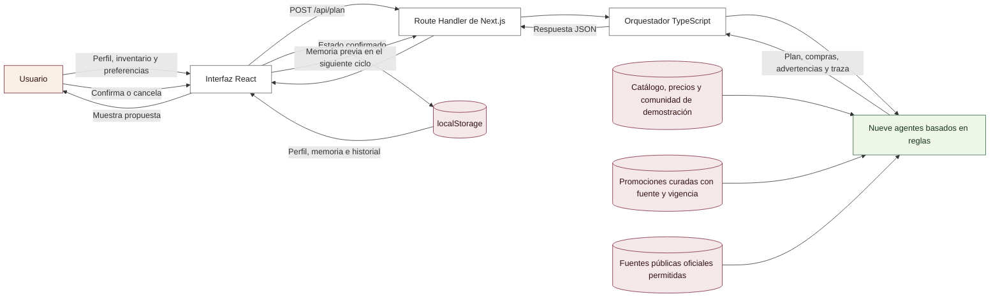
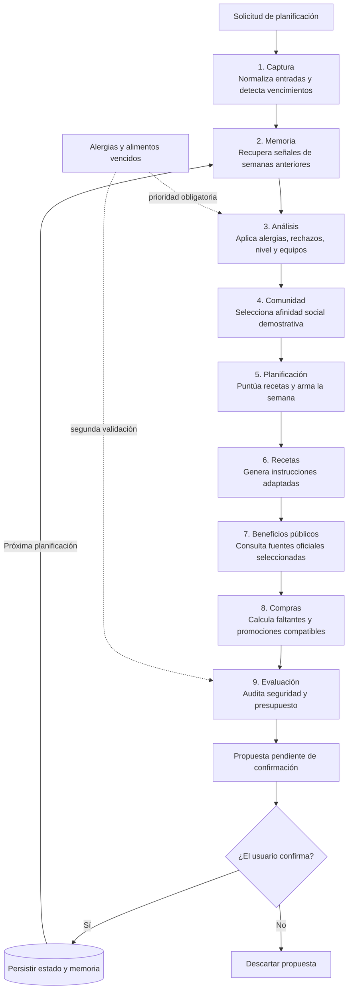
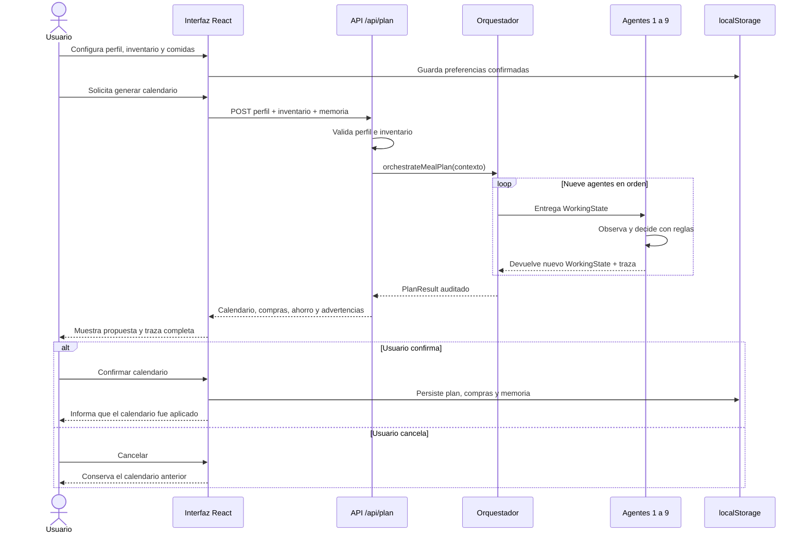

# Arquitectura técnica de MealBoard

## 1. Visión general

MealBoard es una aplicación web para organizar comidas semanales a partir del
perfil, inventario, presupuesto y preferencias de una persona que vive sola.
La solución combina una interfaz React, un endpoint HTTP y un orquestador de
nueve agentes determinísticos implementados con reglas de dominio.

El término *agente* describe módulos independientes que observan un estado de
trabajo, toman una decisión acotada y entregan un nuevo estado. La versión
actual no ejecuta un LLM ni consume una API de inteligencia artificial. Su
comportamiento es local, explicable y reproducible.

### Diagrama general del sistema

### Clasificación de componentes

| Componente | Tipo | Responsabilidad |
|---|---|---|
| Interfaz React | Lógica tradicional | Captura datos, presenta resultados y solicita confirmación. |
| API `/api/plan` | Lógica tradicional | Valida la entrada mínima y expone el orquestador por HTTP. |
| Orquestador | Coordinación agéntica | Ejecuta los nueve módulos en un orden fijo. |
| Nueve agentes | IA simbólica basada en reglas | Analizan restricciones, consultan fuentes permitidas y construyen una recomendación explicable. |
| Catálogo | Datos de demostración | Provee recetas y precios de referencia. |
| Promociones verificadas | Datos externos curados | Conserva vigencia, fecha de verificación y fuente oficial. |
| OpenStreetMap / Overpass | Datos abiertos externos | Busca supermercados próximos después del permiso de ubicación. |
| Agente complementario de comercios | Consulta determinística bajo demanda | Consulta solo las páginas oficiales de cadenas detectadas cerca del usuario y filtra por los medios elegidos. |
| Navegador de fuentes oficiales | Infraestructura acotada | Recorre enlaces internos relevantes, impide salir del dominio, aplica límites y recuerda temporalmente rutas útiles. |
| `localStorage` | Persistencia local | Conserva perfil, memoria, inventario, compras y evaluaciones. |

## 2. Flujo de agentes

Todos los agentes reciben y devuelven un `WorkingState`. No mutan directamente
el estado recibido: cada uno crea una copia con sus resultados y agrega una
entrada a la traza visible `Observó / Decidió / Entregó`.

### Decisión de cada agente

| Orden | Agente | Qué observa | Qué decide | Qué entrega |
|---:|---|---|---|---|
| 1 | Captura | Perfil, inventario y comidas solicitadas | Cómo normalizar datos y separar alimentos urgentes o vencidos | Estado inicial validado |
| 2 | Memoria | Evaluaciones y recuerdos previos | Si conviene priorizar rapidez, ahorro o variedad | Señales y etiquetas preferidas |
| 3 | Análisis | Alergias, rechazos, vencimientos, nivel y electrodomésticos | Qué recetas son seguras y realizables | Recetas candidatas filtradas |
| 4 | Comunidad | Preferencias y calendarios demostrativos | Qué calendario aporta mayor afinidad | Fuente comunitaria y etiquetas |
| 5 | Planificación | Candidatas, presupuesto, urgencias y afinidad | Qué receta ocupa cada comida de la semana | Calendario semanal propuesto |
| 6 | Recetas | Comidas elegidas, nivel y equipos | Cómo explicar cada preparación de forma breve | Guías de cocina |
| 7 | Beneficios públicos | Medios seleccionados y fuentes oficiales permitidas | Qué publicaciones públicas pueden mostrarse como referencia | Estado, fuente y fragmentos públicos, sin aplicarlos como ahorro |
| 8 | Compras | Ingredientes requeridos, inventario, banco y tarjeta | Qué falta comprar y qué promoción estructurada es compatible | Lista, costo y ahorro estimado |
| 9 | Evaluación | Plan completo, restricciones y presupuesto | Si el resultado es seguro y qué advertencias mostrar | Propuesta auditada para confirmar |

El flujo es secuencial dentro de cada ejecución. Se vuelve cíclico entre
semanas porque la evaluación y las acciones confirmadas alimentan la memoria
que se consulta en la planificación siguiente.

## 3. Persistencia y control del usuario

La memoria vive en el navegador bajo la clave `mealboard-state`. Allí se
guardan el perfil, el calendario confirmado, el inventario, la lista de compras,
las evaluaciones, las compras y los registros aprendidos. No se utiliza una
base de datos remota para estos datos.

El usuario conserva control explícito sobre la memoria: puede consultarla,
corregir registros, eliminarlos o restablecer todos los datos de demostración.
La aplicación también migra perfiles antiguos que guardaban banco y tipo de
tarjeta en un único campo.

## 4. UML de secuencia: generar y confirmar un calendario

## 5. Decisiones y límites de la arquitectura

- Las restricciones de seguridad alimentaria se validan antes y después de
  planificar.
- El ciclo principal conserva nueve agentes. La búsqueda desde supermercados
  es un agente complementario disparado después de obtener la ubicación, porque
  los comercios cercanos no forman parte de la solicitud de planificación.
- La consulta web permite hasta dos niveles y seis páginas por sitio, con un
  presupuesto total de doce segundos. Solo sigue HTTPS dentro del mismo dominio
  oficial y prioriza secciones de promociones, beneficios, pagos y legales.
- El aprendizaje de navegación consiste en aumentar la prioridad de las URLs
  que entregaron coincidencias. Se conserva en memoria de proceso y no contiene
  información personal del usuario.
- Ningún calendario propuesto modifica el estado persistente sin confirmación.
- Las promociones solo se aplican cuando coinciden exactamente banco y tipo de
  tarjeta, y su período de vigencia incluye la fecha de consulta.
- Los precios y la actividad comunitaria son datos de demostración. Las
  promociones enlazan sus condiciones oficiales y requieren confirmación antes
  de pagar.
- La geolocalización es opcional, no se persiste y se envía a Overpass solo al
  solicitar supermercados cercanos.
- La persistencia en `localStorage` simplifica el MVP y evita costos, pero no
  sincroniza información entre dispositivos y no reemplaza una base de datos
  multiusuario.
- El motor por reglas favorece explicabilidad y costo cero, aunque comprende
  menos variaciones de lenguaje que un modelo generativo.

## 6. Correspondencia con el código

| Elemento | Archivo principal |
|---|---|
| Interfaz y persistencia | `app/page.tsx` |
| Entrada HTTP | `app/api/plan/route.ts` |
| Orquestación | `lib/agents/orchestrator.ts` |
| Contratos compartidos | `lib/agents/types.ts` |
| Agentes independientes | `lib/agents/*-agent.ts` |
| Recetas y precios demostrativos | `lib/agents/catalog.ts` |
| Compatibilidad de pagos | `lib/payments.ts` |
| Lectura segura de persistencia | `lib/persistence.ts` |
| Pruebas integrales | `tests/*.test.mjs` |
